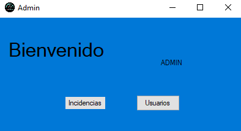
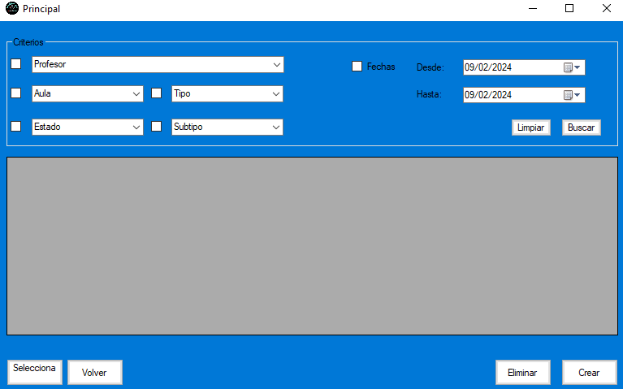
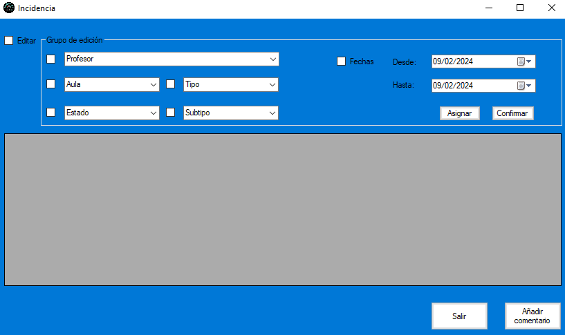
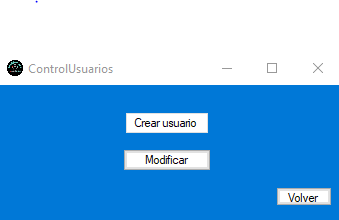
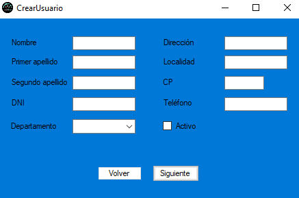
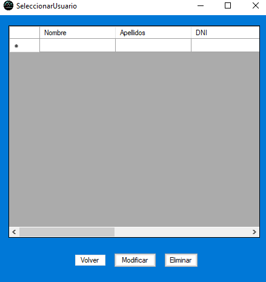
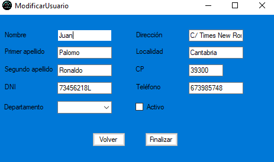
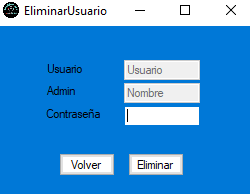

# Proyecto Intermodular

## Inicial
Esta sera la primera pagina que aparecera tras haber iniciado la aplicación y mostrar un nombre y un solo boton llamado *INICIAR* con la unica funcion de llevar a la pagina de *Admin*.

___
## Admin
Esta sera la pagina de bienvenida, en ella tendremos 2 botones.

- **Incidencias**: Al pulsar este boton nos llevara a la pagina de incidencias.
- **Usuarios**: Al pulsar este boton nos llevara a la pagina de control de usuarios.

___
## Principal
Esta pagina sera en la que se realizaran la mayoria de tareas principales. Cuenta con un buscador muy avanzado para buscar por varias propiedades si existen o no, ya sea por: Profesor, Aula, Estado de la incidencia, Subtipo de incidencia, Tipo de incidencia, fecha. Contara con un visor que mostrara los datos de las incidencias encontradas. Por ultimo cuenta con 7 botones.

- **Limpiar**: Al pulsar este boton dejara los valores del buscador a sus valores por defecto.
- **Buscar**: Al pulsar este boton en el visor se mostraran las posibles coincidencias de inicidencias.
- **Selecciona**: Al pulsar este boton nos llevara a la pagina de incidencias.
- **Volver**: Al pulsar este boton nos llevara de vuelata a la pagina de *Admin*.
- **Salir**: Al pulsar este boton nos cierra la aplicacion.
- **Eliminar**: Al pulsar este boton si ya habias seleccionado una incidencia nos la eliminara abriendo una ventana de confirmacion o denegacion. 
- **Crear**: Al pulsar este boton nos llevara a la pagina de creación de incidencias.

Nota: Los botones de *Volver* y **Salir* dependen del usuario:
- **Admin**: Se muestra *Volver* pero no *Salir*.
- **Otro**: Se muestra *Salir* pero no *Volver*.

___
## Incidencia
Esta pagina sera en la que se realizaran las funciones de edición y asignación de incidencias (la opcion de edicion estara deshabiltada). Cuenta con un editor muy avanzado para editar por varias propiedades si existen o no, ya sea por: Profesor, Aula, Estado de la incidencia, Subtipo de incidencia, Tipo de incidencia, fecha. Contara con un visor que mostrara los datos de todas las incidencias (Solo se podra editar la incidencia si ya habia sido seleccionada). Por ultimo cuenta con 4 botones. 	

- **Asignar**: Al pulsar este boton se asignan una incidencia ya seleccionada a otra.
- **Confirmar**: Al pulsar este boton, si ya habias hecho cambios, confirmas los nuevos cambios y guardas la incidencia.
- **Salir**: Al pulsar este boton nos llevara de vuelta a la pagina principal.
- **Añadir comentario**: Al pulsar este boton nos llevara a la pagina de añadir comentario.

___
## Añadir Comentario
Esta pagina sera en la que se crearan y asignaran comentarios. Cuenta con un buscador de archivos y un cuadro de texto para escribir cualquier texto. Por ultimo con 3 botones.

- **Añadir archivo**: Al pulsar este boton nos mostrara un Explorador de archivos para asignar una ruta.
- **Volver**: Al pulsar este boton nos llevara de vuelta a la pagina de incidencias.
- **Añadir**: Al pulsar este boton nos guardara el nuevo comentario y nos llevara de vuelta a la pagina de incidencias.

___
## Crear Incidencia
Esta pagina sera en la que se realizaran las funciones de creacion de incidencias. Cuenta con varios cuadros de texto ya sea: nombre del creador, tipo de incidencia, subtipo de incidencia, estado de incidencia, nombre de responsable si tuviera, nombre de equipo, fecha de creacion, fecha de cierre si tuviera y un buscador de archivo. Por ultimo cuenta con 3 botones.

- **Añadir archivo**: Al pulsar este boton nos mostrara un Explorador de archivos para asignar una ruta.
- **Volver**: Al pulsar este boton nos llevara de vuelta a la pagina principal.
- **Añadir**: Al pulsar este boton nos guardara la nueva incidencia y nos llevara de vuelta a la pagina principal.

___
## Control Usuarios
Esta sera la pagina en la que se realizaran las opciones relacionadas con los usuarios. Por ultimo cuenta con 3 botones.

- **Crear usuario**: Al pulsar este boton nos llevara a la pagina de creacion de usuario.
- **Modificar**: Al pulsar este boton nos llevara a la pagina de seleccion de usuario.
- **Volver**: Al pulsar este boton nos llevara de vuelta a la pagina principal.

___
## Crear Usuario
Esta pagina sera en la que se realizaran las funciones de creacion de usuarios. Cuenta con varios cuadros de texto ya sea: datos personales y si esta activo o no. Por ultimo cuenta con 2 botones.

- **Volver**: Al pulsar este boton nos llevara de vuelta a la pagina de control de usuarios.
- **Siguiente**: Al pulsar este boton nos llevara a la pagina de creacion de perfil.

___
## Crear Perfil
Esta pagina es la continuacion de la creacion de usuarios y sera en la que realizaran las funciones de creacion de perfiles de usuarios. Cuenta con varios cuadros de texto ya sea: nombre de dominio, cuenta de educantabria, contraseña y tipo de perfil. Por ultimo cuenta con 2 botones.

- **Volver**: Al pulsar este boton nos llevara de vuelta a la pagina de control de usuarios.
- **Crear**: Al pulsar este boton nos guardara el nuevo usuario y su perfil ya creados y nos llevara de vuelta a la pagina de control de usuarios.

___
## Seleccionar Usuario
Esta pagina es la encargada tanto de la modificacion como la eliminacion de usuarios. Cuenta con un visor en el que se mostraran todos los usuarios que haya. con sus datos personales. Por ultimo cuenta con 3 botones.(No se podran usar algunas acciones si no se seleccionado primero un usuario del visor)

- **Volver**: Al pulsar este boton nos llevara de vuelta a la pagina de control de usuarios.
- **Modificar**: Al pulsar este boton nos llevara a la pagina de modificacion de usuario.
- **Eliminar**: Al pulsar este boton nos llevara a la pagina de eliminacion de usuario.

___
## Modificar Usuario
Esta pagina sera en la que se realizaran las funciones de modificacion de usuarios. Cuenta con varios cuadros de texto ya sea: datos personales y si esta activo o no. Por ultimo cuenta con 2 botones.

- **Volver**: Al pulsar este boton nos llevara de vuelta a la pagina de seleccion de usuarios.
- **Finalizar**: Al pulsar este boton nos guardara los cambios realizados y nos llevara de vuelta a la pagina de seleccion de usuarios.

___
## Eliminar Usuario
Esta pagina sera en la que se realizaran las funciones de eliminacion de usuarios. Cuenta con varios cuadros de texto ya sea: nombre de usuario, nombre de admin y contraseña. Por ultimo cuenta con 2 botones.

- **Volver**: Al pulsar este boton nos llevara de vuelta a la pagina de seleccion de usuarios.
- **Eliminar**: Al pulsar este boton nos eliminara el usuario seleccionado y nos llevara de vuelta a la pagina de seleccion de usuarios.

# Encabezado1
## Encabezado2
### Encabezado3
#### Encabezado4
##### Encabezado5
###### Encabezado6

Subrayado 1

===

Subrayado 2

-—-

> Citas. 
>> Citas.

Listas sin enumeracion
* Elemento 1
- Elemento 2
+ Elemento 3

Listas con enumeracion:
1. Elemento 1
	- A
	- B
2. Elemento 2
	+ 1
	+ 2
3. Elemento 3

~~~
Bloque
~~~

Separadores

***
---
___

*Texto negrita*

_Texto negrita_

**Texto cursiva**

__Texto cursiva__

***Texto negrita y cursiva***

___Texto negrita y cursiva___

[Enlace](www.google.com)

`Codigo`

    Texto preformado con 4 espacios en blanco
	

<www.google.com>

Tabla
|Columna 1|Columna 2|
|--------|--------|
|    A    |    B    |
|    C    |    D    |
