# Proyecto Intermodular

## Personal-controlador
En esta imagen se pueden ver algunos métodos del controlador personal; ya sea mostrar, modificar o eliminar.

- __GET(/api/personal/{id})__: Muestra los datos de un elemento personal introduciendo un id.
- __PUT(/api/personal/{id})__: Modifica un elemento personal introduciendo un id.
- __DELETE(/api/personal/{id})__: Elimina un elemento personal introduciendo un id.
- __GET(/api/personal)__: Muestra los datos de todos los elementos personal.
- __POST(/api/personal)__: Crea un nuevo elemento personal.
- __GET(/api/personal/nombre/{nombre})__: Muestra todos los elementos personal introduciendo un nombre.
- __GET(/api/personal/apellido2/{apellido})__: Muestra todos los elementos personal introduciendo un apellido1.
- __GET(/api/personal/apellido1/{apellido})__: Muestra todos los elementos personal introduciendo un apellido2.
- __DELETE(/api/personal/borrar_usuario/{id usuario})__: Elimina un elemento personal introduciendo un id con permisos de Administrador.

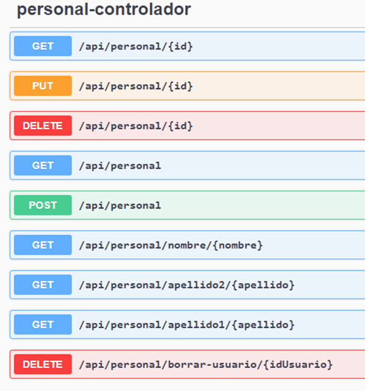

___

## Personal-controlador(GET(/api/personal/{id}))
En esta imagen se muestra cómo se usa el método buscar personal por id.

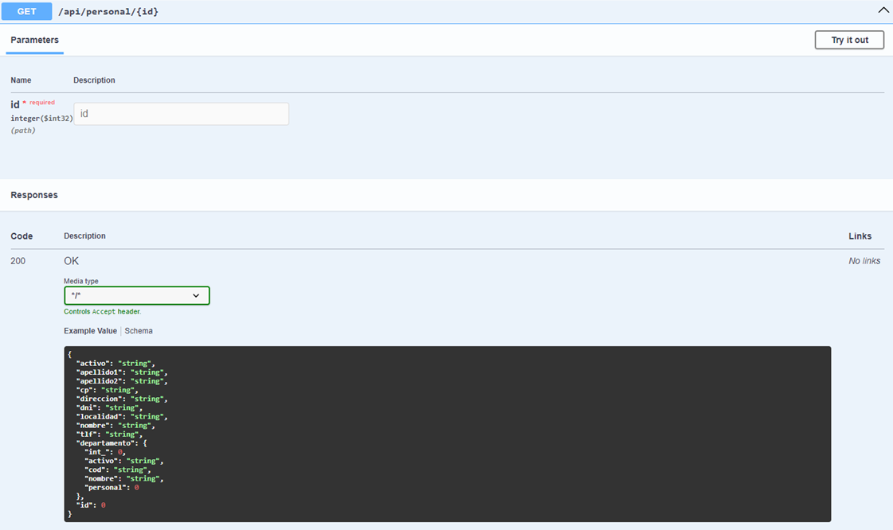

___

## Personal-controlador(PUT(/api/personal/{id}))
En esta imagen se muestra cómo se usa el método modificar personal por id.

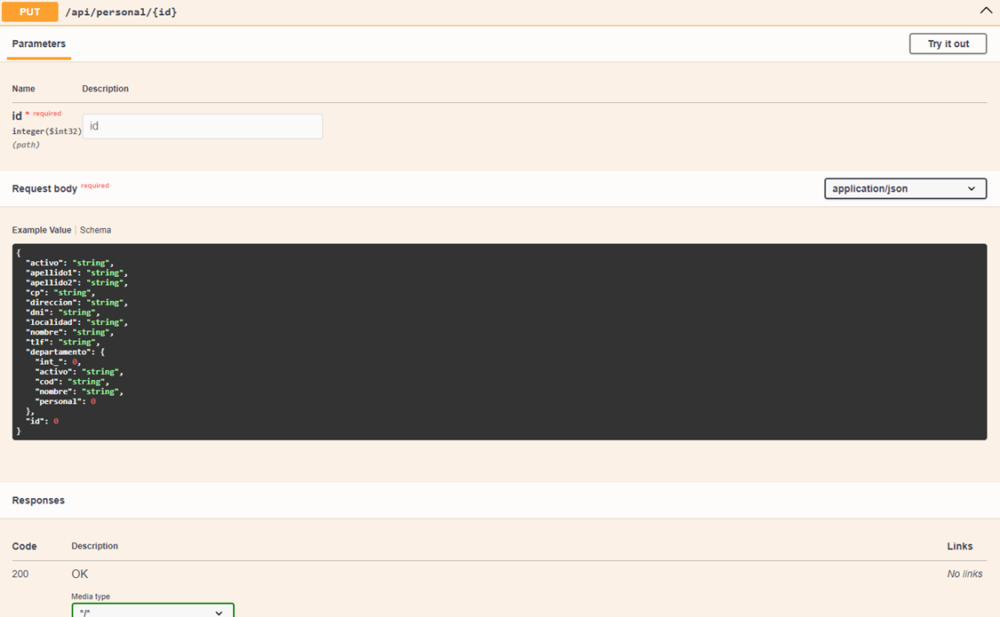

___

## Personal-controlador(DELETE(/api/personal/{id}))
En esta imagen se muestra cómo se usa el método eliminar personal por id.

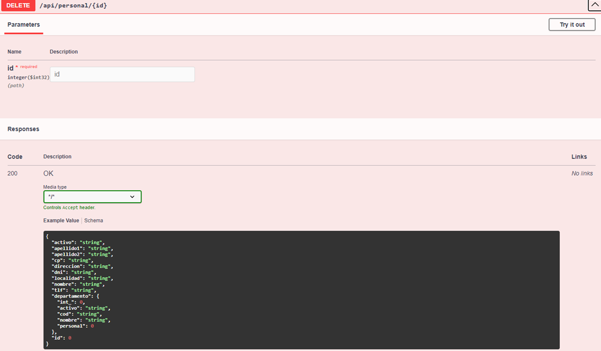

___

## Personal-controlador(GET(/api/personal))
En esta imagen se muestra cómo se usa el método mostrar personal.

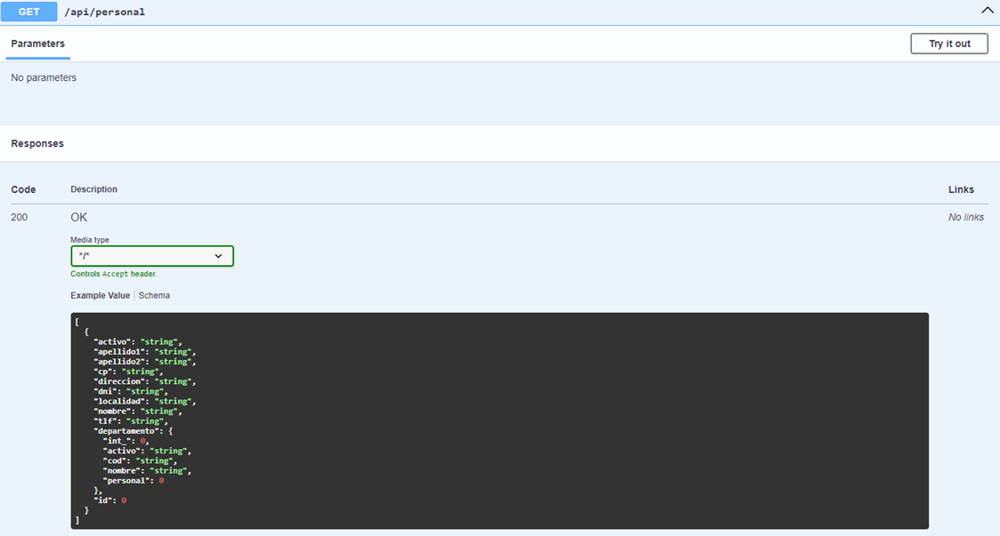

___

## Personal-controlador(POST(/api/personal))
En esta imagen se muestra cómo funciona el método crear personal.

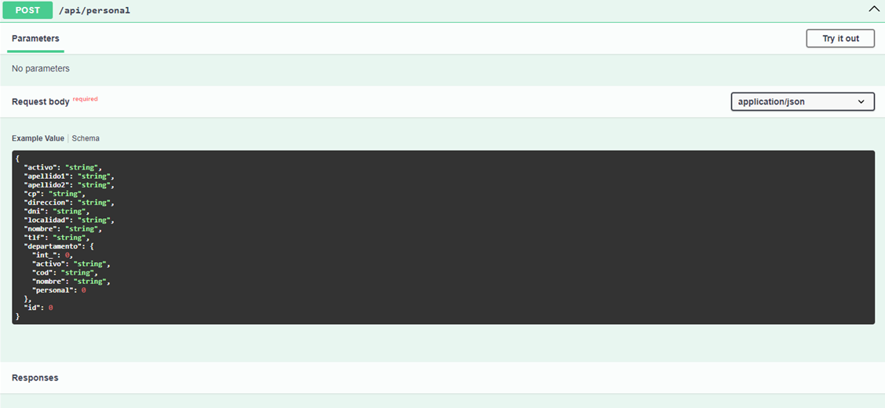

___

## Personal-controlador(GET(/api/personal/nombre/{nombre}))
En esta imagen se muestra cómo se usa el método buscar por nombre.

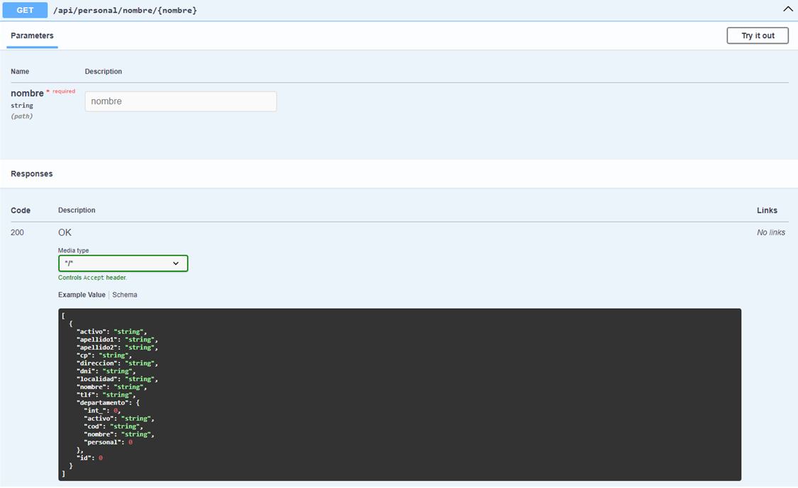

___

## Personal-controlador(GET(/api/personal/apellido2/{apellido}))
En esta imagen se muestra cómo se usa el método buscar por apellido2.

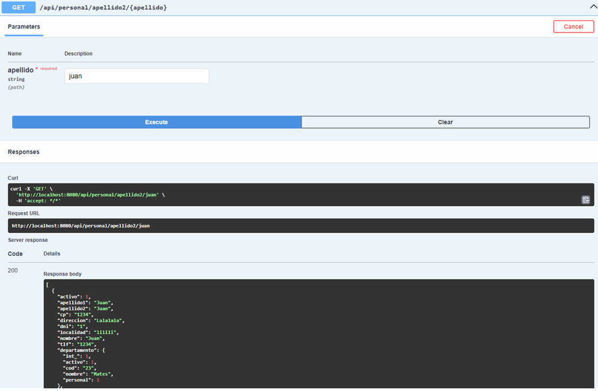

___

## Personal-controlador(GET(/api/personal/apellido1/{apellido}))
En esta imagen se muestra cómo se usa el método buscar por apellido1.

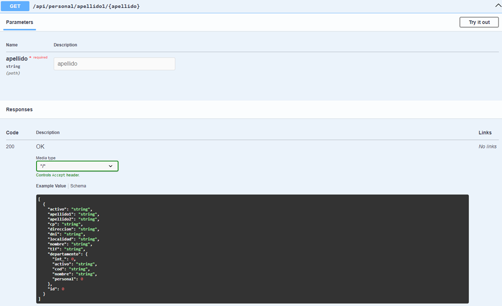

___

## Personal-controlador(DELETE(/api/personal/borrar_usuario/{idUsuario}))
En esta imagen se muestra cómo se usa el método borrar personal por idUsuario. Este método también requiere id de Administrador y contraseña de Administrador.

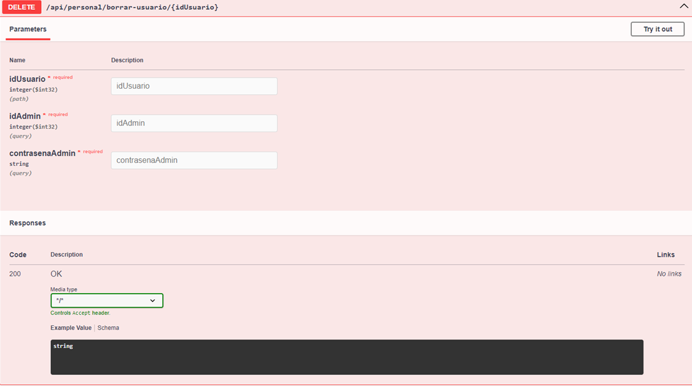

___

## Perfiles-controlador
En esta imagen se pueden ver algunos métodos del controlador perfiles; ya sea mostrar, modificar o eliminar.

- __GET(/api/perfiles/{id})__: Muestra los datos de un elemento perfil introduciendo un id.
- __PUT(/api/perfiles/{id})__: Modifica un elemento perfil introduciendo un id.
- __DELETE(/api/perfiles/{id})__: Elimina un elemento perfil introduciendo un id.
- __GET(/api/perfiles)__: Muestra los datos de todos los elementos perfil.
- __POST(/api/perfiles)__: Crea un nuevo elemento perfil.
- __GET(/api/perfiles/tipo/{perfil})__: Muestra todos los elementos perfil introduciendo un perfil.
- __GET(/api/perfiles/dominio/{dominio})__: Muestra todos los elementos perfil introduciendo un dominio.

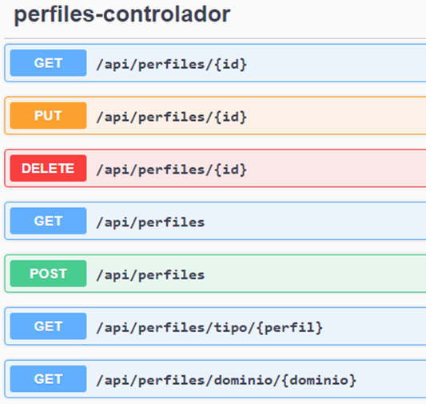

___

## Perfil-controlador(GET(/api/perfiles/tipo/{perfil}))
En esta imagen se muestra cómo se usa el método buscar tipo de perfil por perfil.

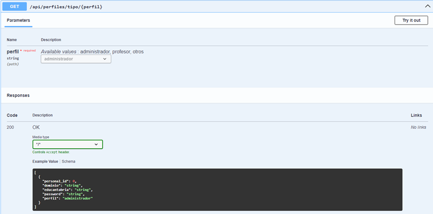

___

## Perfil-controlador(GET(/api/perfiles/dominio/{dominio}))
En esta imagen se muestra cómo se usa el método buscar dominio de perfil por dominio.

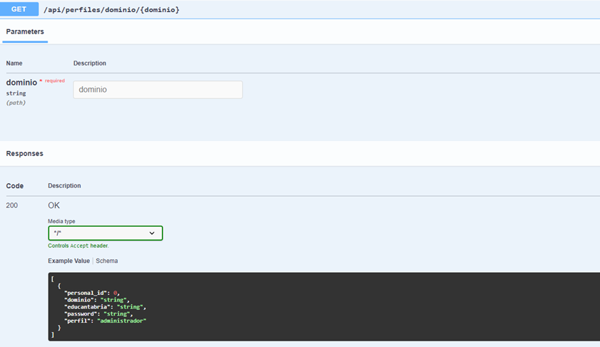

___

## Incidencias-subtipo-controlador
En esta imagen se pueden ver algunos métodos del controlador incidencias-subtipo; ya sea mostrar, modificar o eliminar.

- __GET(/api/incidencias-subtipos/{id})__: Muestra los datos de un elemento incidencias-subtipos introduciendo un id.
- __PUT(/api/incidencias-subtipos/{id})__: Modifica un elemento incidencias-subtipos introduciendo un id.
- __DELETE(/api/incidencias-subtipos/{id})__: Elimina un elemento incidencias-subtipos introduciendo un id.
- __GET(/api/incidencias-subtipos)__: Muestra los datos de todos los elementos incidencias-subtipos.
- __POST(/api/incidencias-subtipos)__: Crea un nuevo elemento incidencias-subtipos.
- __GET(/api/incidencias-subtipos/tipo/{tipo})__: Muestra todos los elementos incidencias-subtipos introduciendo un tipo de incidencia.

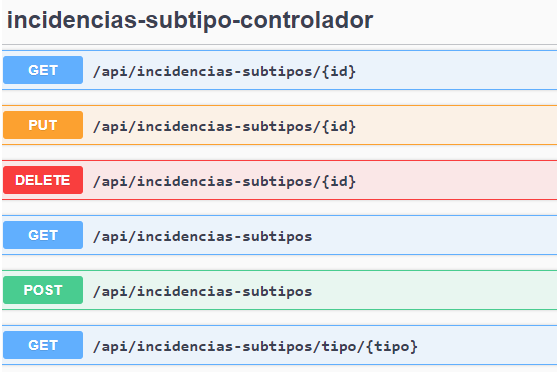

___

## Incidencias-subtipo-controlador(GET(/api/incidencias-subtipos/tipo/{tipo}))
En esta imagen se muestra cómo se usa el método buscar por tipo de incidencia.

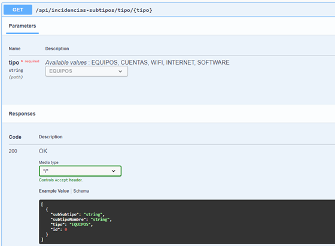

___

## Incidencias-controlador
En esta imagen se pueden ver algunos métodos del controlador personal; ya sea mostrar, modificar o eliminar.

- __GET(/api/incidencias/{num})__: Muestra los datos de un elemento personal introduciendo un id.
- __PUT(/incidencias/{num})__: Modifica un elemento incidencias introduciendo un núm.
- __DELETE(/api/incidencias/{num})__: Elimina un elemento incidencias introduciendo un num.
- __GET(/api/incidencias)__: Muestra los datos de todos los elementos incidencias.
- __POST(/api/incidencias)__: Crea un nuevo elemento incidencias.
- __GET(/api/incidencias/tipo/{tipo})__: Muestra el tipo de todos los elementos incidencias introduciendo un tipo de incidencias.
- __GET(/api/incidencias/responsable/{id})__: Muestra todos los elementos incidencias introduciendo un id de responsable.
- __GET(/api/incidencias/fecha-creación/{fechaCreacion})__: Muestra todos los elementos incidencias introduciendo una fecha de creación.
- __GET(/api/incidencias/fecha-cierre/{fechaCierre})__: Muestra todos los elementos incidencias introduciendo una fecha de cierre. 
- __GET(/api/incidencias/estado/{estado})__: Muestra todos los elementos incidencias introduciendo un estado.
- __GET(/api/incidencias/creador/{id})__: Muestra todos los elementos incidencias introduciendo un id de creador.
- __GET(/api/incidencias/buscar)__: Muestra un buscador de incidencias.

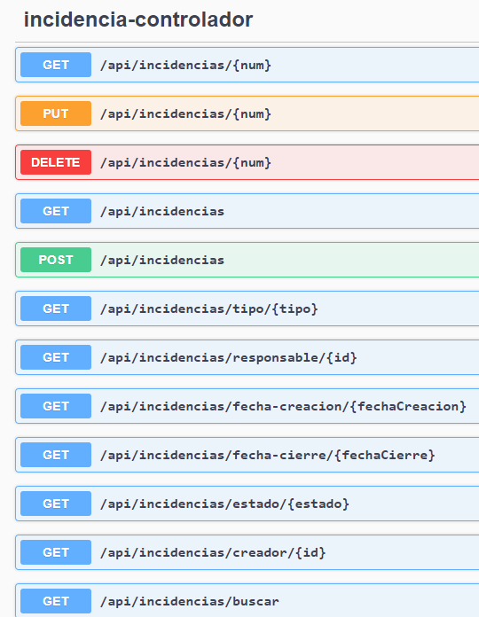

___

## Incidencias-controlador(GET(/api/incidencias/tipo/{tipo}))
En esta imagen se muestra cómo se usa el método buscar por tipo de incidencia.

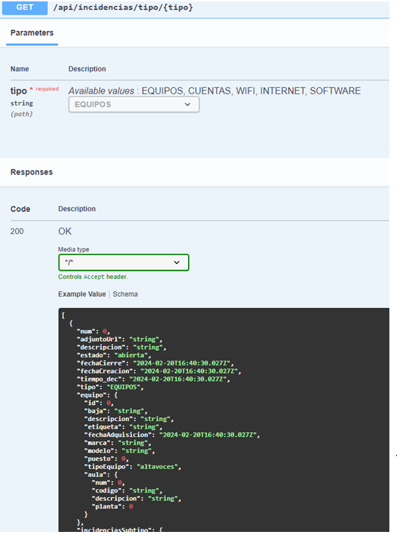

___

## Incidencias-controlador(GET(/api/incidencias/responsable/{id}))
En esta imagen se muestra cómo se usa el método buscar por id de responsable.

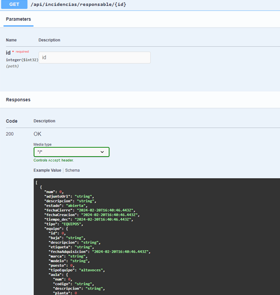

___

## Incidencias-controlador(GET(/api/incidencias/fecha-creacion/{fechaCreacion}))
En esta imagen se muestra cómo se usa el método buscar fecha por fecha de creación.

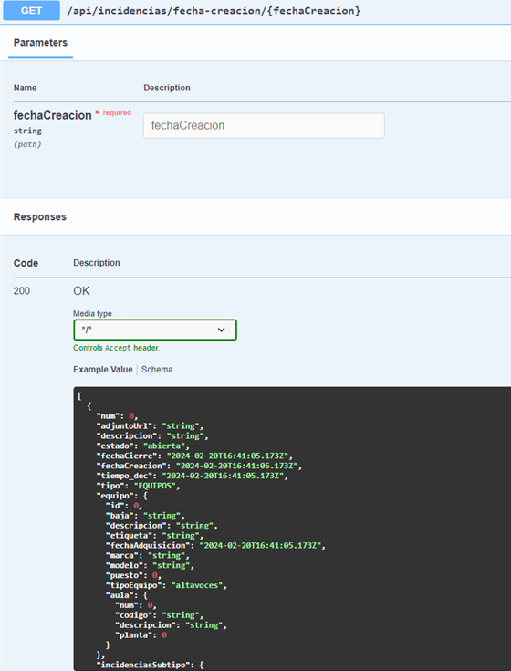

___

## Incidencias-controlador(GET(/api/incidencias/fecha-cierre/{fechaCierre}))
En esta imagen se muestra cómo se usa el método buscar fecha por fecha de cierre.

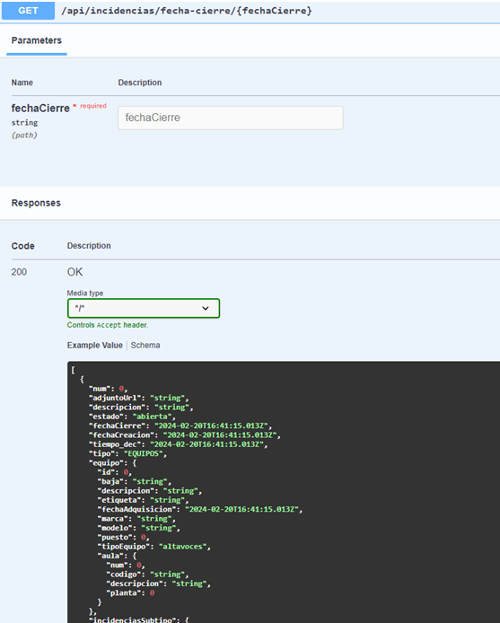

___

## Incidencias-controlador(GET(/api/incidencias/estado/{estado}))
En esta imagen se muestra cómo se usa el método buscar por estado.

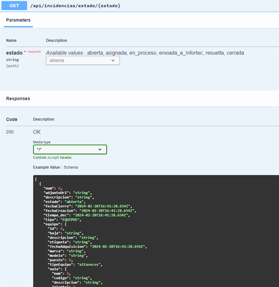

___

## Incidencias-controlador(GET(/api/incidencias/creador/{id}))
En esta imagen se muestra cómo se usa el método buscar por id de creador.

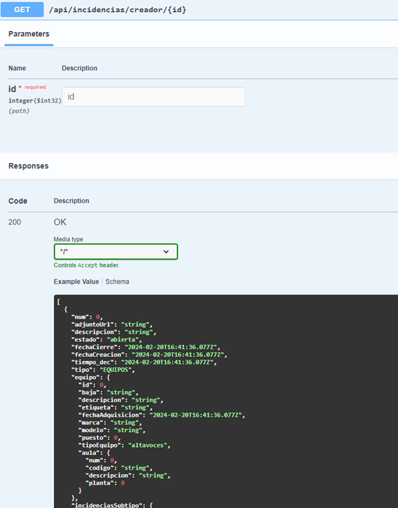

___

## Equipo-controlador
En esta imagen se pueden ver algunos métodos del controlador equipo; ya sea mostrar, modificar o eliminar.

- __GET(/api/equipos/{id})__: Muestra los datos de un elemento equipo introduciendo un id.
- __PUT(/api/equipos/{id})__: Modifica un elemento equipo introduciendo un id.
- __DELETE(/api/equipos/{id})__: Elimina un elemento equipo introduciendo un id.
- __GET(/api/equipos)__: Muestra los datos de todos los elementos equipo.
- __POST(/api/equipos)__: Crea un nuevo elemento equipo.

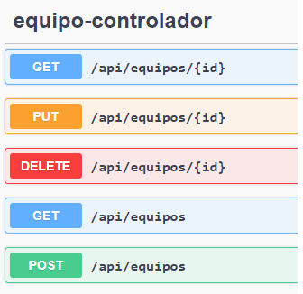
___

## Departamento-controlador
En esta imagen se pueden ver algunos métodos del controlador departamento; ya sea mostrar, modificar o eliminar.

- __GET(/api/departamentos/{id})__: Muestra los datos de un elemento departamento introduciendo un id.
- __PUT(/api/departamentos/{id})__: Modifica un elemento departamento introduciendo un id.
- __DELETE(/api/departamentos/{id})__: Elimina un elemento departamento introduciendo un id.
- __GET(/api/departamentos)__: Muestra los datos de todos los elementos departamento.
- __POST(/api/departamentos)__: Crea un nuevo elemento departamento.

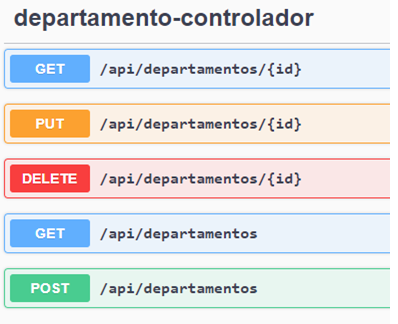

___

## Comentario-controlador
En esta imagen se pueden ver algunos métodos del controlador comentario; ya sea mostrar, modificar o eliminar.

- __GET(/api/comentarios/{id})__: Muestra los datos de un elemento comentario introduciendo un id.
- __PUT(/api/comentarios/{id})__: Modifica un elemento comentario introduciendo un id.
- __DELETE(/api/comentarios/{id})__: Elimina un elemento comentario introduciendo un id.
- __GET(/api/comentarios)__: Muestra los datos de todos los elementos comentario.
- __POST(/api/comentarios)__: Crea un nuevo elemento comentario.

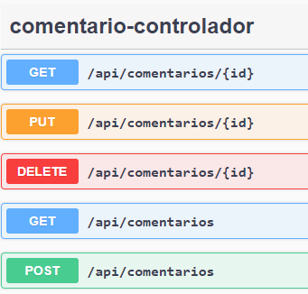

___

## aula-controlador
En esta imagen se pueden ver algunos métodos del controlador aula; ya sea mostrar, modificar o eliminar.

- __PUT(/api/aula/aula/{num})__: Modifica un elemento aula introduciendo un num.
- __DELETE(/api/aula/aula/{num})__: Elimina un elemento aula introduciendo un num.
- __POST(/api/aula/aula)__: Crea un nuevo elemento aula.
- __GET(/api/aula)__: Muestra los datos de todos los elementos aula.
- __GET(/api/aula/{num})__: Muestra todos los elementos aula introduciendo un num.
- __GET(/api/aula/planta/{planta})__: Muestra la planta de todos los elementos aula introduciendo una planta.

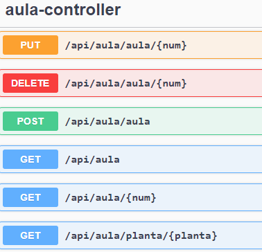

___

## Aula-controlador(GET(/api/aula/planta/{planta}))
En esta imagen se muestra cómo se usa el método buscar por planta.

