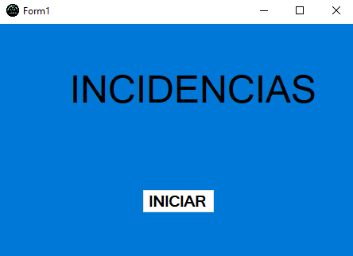

# Proyecto Intermodular

## Personal-controlador
En esta imagen se pueden ver algunos metodos del controlador personal; ya se mostrar, modificar o eliminar.

- __GET(/api/personal/{id})__: Muestra los datos de un elemento personal introduciendo un id.
- __PUT(/api/personal/{id})__: Modifica un elemento personal introduciendo un id.
- __DELETE(/api/personal/{id})__: Elimina un elemento personal introduciendo un id.
- __GET(/api/personal)__: Muestra los datos de todos los elementos personal.
- __POST(/api/personal)__: Crea un nuevo elemento personal introduciendo un id.
- __GET(/api/personal/nombre/{nombre})__: Muestra el nombre de un elemento personal introduciendo un nombre.
- __GET(/api/personal/apellido2/{apellido})__: Muestra el segundo apellido de un elemento personal introduciendo un apellido.
- __GET(/api/personal/apellido1/{apellido})__: Muestra el primer apellido de un elemento personal introduciendo un apellido.
- __DELETE(/api/personal/borrar_usuario/{idUsuario})__: Elimina un elemento personal introduciendo un id desde borrar_usuario.

___

# Encabezado1
## Encabezado2
### Encabezado3
#### Encabezado4
##### Encabezado5
###### Encabezado6

Subrayado 1

===

Subrayado 2

-—-

> Citas. 
>> Citas.

Listas sin enumeracion
* Elemento 1
- Elemento 2
+ Elemento 3

Listas con enumeracion:
1. Elemento 1
	- A
	- B
2. Elemento 2
	+ 1
	+ 2
3. Elemento 3

~~~
Bloque
~~~

Separadores

***
---
___

*Texto negrita*

_Texto negrita_

**Texto cursiva**

__Texto cursiva__

***Texto negrita y cursiva***

___Texto negrita y cursiva___

[Enlace](www.google.com)

`Codigo`

    Texto preformado con 4 espacios en blanco
	

<www.google.com>

Tabla
|Columna 1|Columna 2|
|--------|--------|
|    A    |    B    |
|    C    |    D    |
