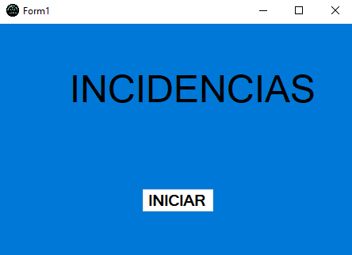
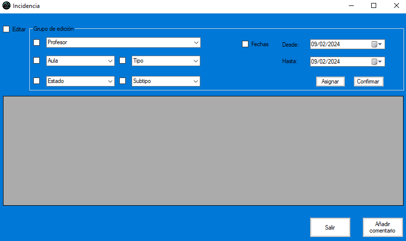
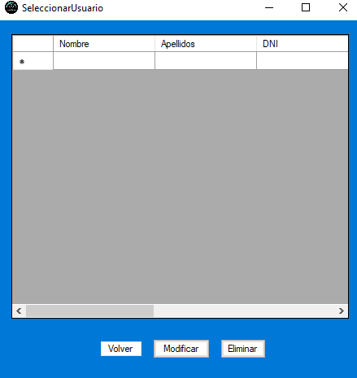
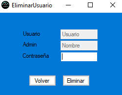

# Proyecto Intermodular

## Inicial
Esta será la primera página que aparecerá tras haber iniciado la aplicación y mostrar un nombre y un solo botón llamado *INICIAR*, con la única función de llevar a la página de *Admin*.

___
## Admin
Esta será la página de bienvenida, en ella tendremos 2 botones.

- **Incidencias**: Al pulsar este botón, nos llevará a la página de incidencias.
- **Usuarios**: Al pulsar este botón, nos llevará a la página de control de usuarios.

___
## Principal
Esta página será en la que se realizarán la mayoría de tareas principales. Cuenta con un buscador muy avanzado para buscar por varias propiedades si existen o no, ya sea por: profesor, aula, estado de la incidencia, subtipo de incidencia, tipo de incidencia, fecha. Contará con un visor que mostrará los datos de las incidencias encontradas. Por último, cuenta con 7 botones.

- **Limpiar**: Al pulsar este botón, dejará los valores del buscador a sus valores por defecto.
- **Buscar**: Al pulsar este botón en el visor, se mostrarán las posibles coincidencias de incidencias.
- **Selecciona**: Al pulsar este botón, nos llevará a la página de incidencias.
- **Volver**: Al pulsar este botón, nos llevará de vuelta a la página de *Admin*.
- **Salir**: Al pulsar este botón, nos cierra la aplicación.
- **Eliminar**: Al pulsar este botón, si ya habías seleccionado una incidencia, nos la eliminará abriendo una ventana de confirmación o denegación. 
- **Crear**: Al pulsar este botón, nos llevará a la página de creación de incidencias.

Nota: Los botones de *Volver* y *Salir* dependen del usuario:
- **Admin**: Se muestra *Volver* pero no *Salir*.
- **Otro**: Se muestra *Salir*, pero no *Volver*.

___
## Incidencia
Esta página será en la que se realizarán las funciones de edición y asignación de incidencias (la opción de edición estará deshabilitada). Cuenta con un editor muy avanzado para editar por varias propiedades si existen o no, ya sea por: Profesor, Aula, Estado de la incidencia, Subtipo de incidencia, Tipo de incidencia, fecha. Contará con un visor que mostrará los datos de todas las incidencias (Solo se podrá editar la incidencia si ya había sido seleccionada). Por último, cuenta con 4 botones.

- **Asignar**: Al pulsar este botón, se asignan una incidencia ya seleccionada a otra.
- **Confirmar**: Al pulsar este botón, si ya habías hecho cambios, confirmas los nuevos cambios y guardas la incidencia.
- **Salir**: Al pulsar este botón, nos llevará de vuelta a la página principal.
- **Añadir comentario**: Al pulsar este botón, nos llevará a la página de añadir comentario.

___
## Añadir Comentario
Esta página será en la que se crearán y asignarán comentarios. Cuenta con un buscador de archivos y un cuadro de texto para escribir cualquier texto. Por último, con 3 botones.

- **Añadir archivo**: Al pulsar este botón, nos mostrará un Explorador de archivos para asignar una ruta.
- **Volver**: Al pulsar este botón, nos llevará de vuelta a la página de incidencias.
- **Añadir**: Al pulsar este botón, nos guardará el nuevo comentario y nos llevará de vuelta a la página de incidencias.

___
## Crear Incidencia
Esta página será en la que se realizarán las funciones de creación de incidencias. Cuenta con varios cuadros de texto, ya sea: nombre del creador, tipo de incidencia, subtipo de incidencia, estado de incidencia, nombre de responsable si tuviera, nombre de equipo, fecha de creación, fecha de cierre si tuviera y un buscador de archivo. Por último, cuenta con 3 botones.

- **Añadir archivo**: Al pulsar este botón, nos mostrará un Explorador de archivos para asignar una ruta.
- **Volver**: Al pulsar este botón, nos llevará de vuelta a la página principal.
- **Añadir**: Al pulsar este botón, nos guardará la nueva incidencia y nos llevará de vuelta a la página principal.

___
## Control Usuarios
Esta será la página en la que se realizarán las opciones relacionadas con los usuarios. Por último, cuenta con 3 botones.

- **Crear usuario**: Al pulsar este botón, nos llevará a la página de creación de usuario.
- **Modificar**: Al pulsar este botón, nos llevará a la página de selección de usuario.
- **Volver**: Al pulsar este botón, nos llevará de vuelta a la página principal.

___
## Crear Usuario
Esta página será en la que se realizarán las funciones de creación de usuarios. Cuenta con varios cuadros de texto, ya sea: datos personales y si está activo o no. Por último, cuenta con 2 botones.

- **Volver**: Al pulsar este botón, nos llevará de vuelta a la página de control de usuarios.
- **Siguiente**: Al pulsar este botón, nos llevará a la página de creación de perfil.

___
## Crear Perfil
Esta página es la continuación de la creación de usuarios y será en la que realizarán las funciones de creación de perfiles de usuarios. Cuenta con varios cuadros de texto, ya sea: nombre de dominio, cuenta de educantabria, contraseña y tipo de perfil. Por último, cuenta con 2 botones.

- **Volver**: Al pulsar este botón, nos llevará de vuelta a la página de control de usuarios.
- **Crear**: Al pulsar este botón, nos guardará el nuevo usuario y su perfil ya creados y nos llevará de vuelta a la página de control de usuarios.

___
## Seleccionar Usuario
Esta página es la encargada tanto de la modificación como la eliminación de usuarios. Cuenta con un visor en el que se mostrarán todos los usuarios que hay con sus datos personales. Por último, cuenta con 3 botones. (No se podrán usar algunas acciones sino se ha seleccionado primero un usuario del visor)

- **Volver**: Al pulsar este botón, nos llevará de vuelta a la página de control de usuarios.
- **Modificar**: Al pulsar este botón, nos llevará a la página de modificación de usuario.
- **Eliminar**: Al pulsar este botón, nos llevará a la página de eliminación de usuario.

___
## Modificar Usuario
Esta página será en la que se realizarán las funciones de modificación de usuarios. Cuenta con varios cuadros de texto, ya sea: datos personales y si está activo o no. Por último, cuenta con 2 botones.

- **Volver**: Al pulsar este botón, nos llevará de vuelta a la página de selección de usuarios.
- **Finalizar**: Al pulsar este botón, nos guardará los cambios realizados y nos llevará de vuelta a la página de selección de usuarios.

___
## Eliminar Usuario
Esta página será en la que se realizarán las funciones de eliminación de usuarios. Cuenta con varios cuadros de texto, ya sea: nombre de usuario, nombre de admin y contraseña. Por último, cuenta con 2 botones.

- **Volver**: Al pulsar este botón, nos llevará de vuelta a la página de selección de usuarios.
- **Eliminar**: Al pulsar este botón, nos eliminará el usuario seleccionado y nos llevará de vuelta a la página de selección de usuarios.

