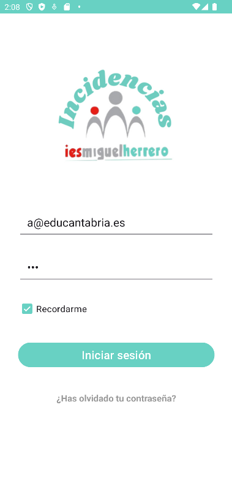
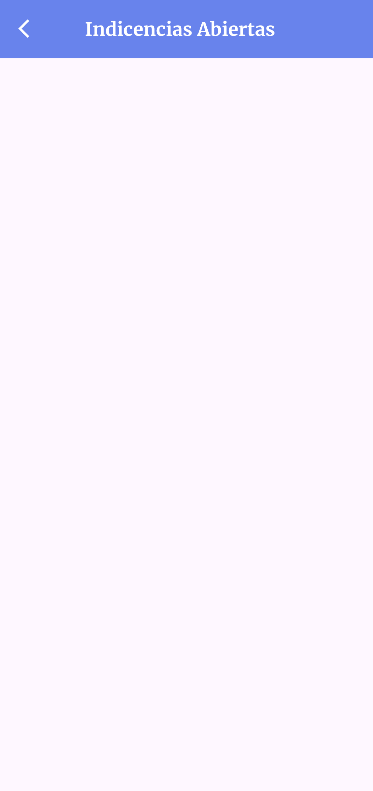
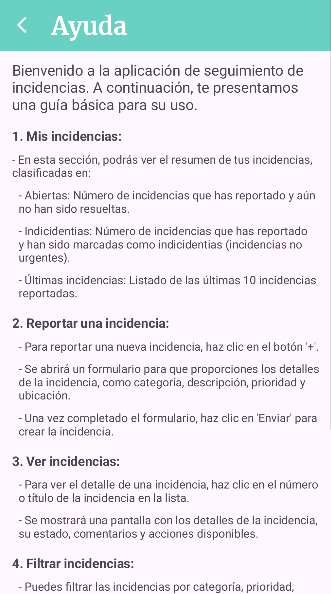
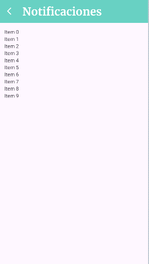
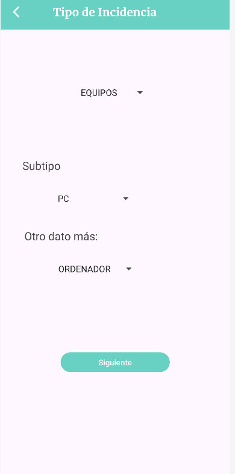
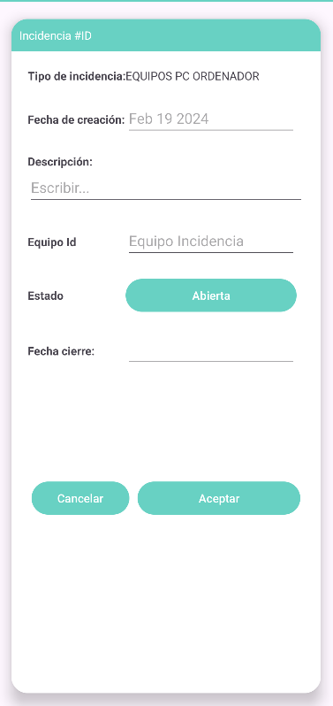
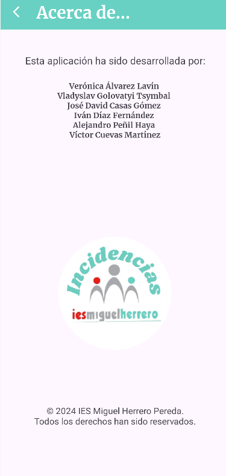

# Proyecto Intermodular

## Login
Esta página será la que aparecerá tras abrir la aplicación, contará con un logo y 2 cuadros de texto en los cuales se escribirá: nombre de usuario y contraseña. También contará con una opción que podemos marcar o no para recordar la contraseña. También contará con un enlace por si has olvidado la contraseña para cambiarla o no. Por último un botón de inicio de sesión que verifica si puedes entrar o no, si da fallo significa que el usuario y/o la contraseña no son correctos. Si todo es correcto, te lleva a la ventana de _Mis_incidencias_.

___

## Mis incidencias
Sería, por así decirlo, la ventana principal que muestra un resumen de las incidencias agrupadas por estado (Abiertas, Asignadas, En proceso, Resueltas, Cerradas), así como una lista de las últimas incidencias añadidas. Tiene un botón para cada una que nos llevará a una ventana con una lista de las incidencias de ese estado, y al hacerlo se cambia el color del fondo del título. También tiene un botón para añadir nuevas incidencias abajo a la derecha que nos llevará a la ventana _Tipo de Incidencia_. Arriba a la derecha cuenta con 3 opciones más (2 ocultas tras un botón de 3 líneas):

- __Añadir notificación (campaña)__: Al pulsar esta opción, nos llevará a la ventana de _Notificaciones_.
- __Ayuda__: Al pulsar esta opción, nos llevará a la ventana de _Ayuda_.
- __Acerca de__: Al pulsar esta opción, nos llevará a la ventana _Acerca de_.

### Ejemplo de ventana

___

## Ayuda
Esta ventana sería una pequeña guía de como funciona la aplicación. Cuenta con una flecha que nos devuelve a _Mis incidencias_.

___

## Notificaciones
Esta es la ventana encarga de las notificaciones en ella se muestra una lista de notificaciones, así como una flecha para volver a la ventana _Mis incidencias_ y la lista con las opciones de _Ayuda_ y _Acerca de_.

___

## Tipo de Incidencia
Sería una parte de la creación de incidencias. Cuenta con una flecha que nos devuelve a _Mis incidencias_, un boton de siguiente que nos lleva a la ventana _Incidencia#ID_ y 3 selectores.

- __Selector 1__: Seleccionar nombre de equipo de la lista.
- __Selector 2__: Seleccionar subtipo de incidencia de la lista.
- __Selector 3__: Seleccionar otro dato de la lista.

___

## Incidencia #ID
Sería la continuación de la ventana _Tipo de incidencia_ que cuenta con muchos más datos que añadir: Tipo de incidencia (por defecto lo que estaba en los selectores 1 y 2 de la anterior), fecha de creación, posible descripción, identificador de equipo, estado (Abierto, Asignado, En proceso, Resuelta, Cerrado), fecha de cierre. Así como 2 botones:

- __Cancelar__: Al pulsar esta opción, nos llevará a la ventana de _Mis incidencias_.
- __Aceptar__: Al pulsar esta opción, nos llevará a la ventana de _Mis incidencias_ pero con la nueva incidencia ya añadida.

___

## Acerca de
Esta ventana solo sería un resumen, cuenta con una flecha que nos devuelve a la venta _Mis incidencias_. Muestra los nombres de sus desarrolladores, un logo y un texto de copyright con año actual.

