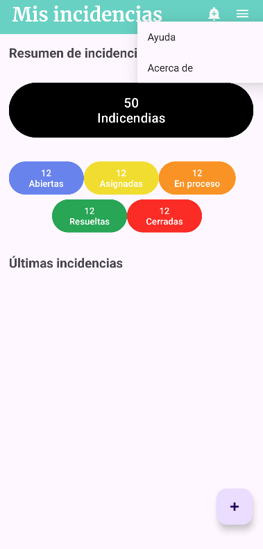
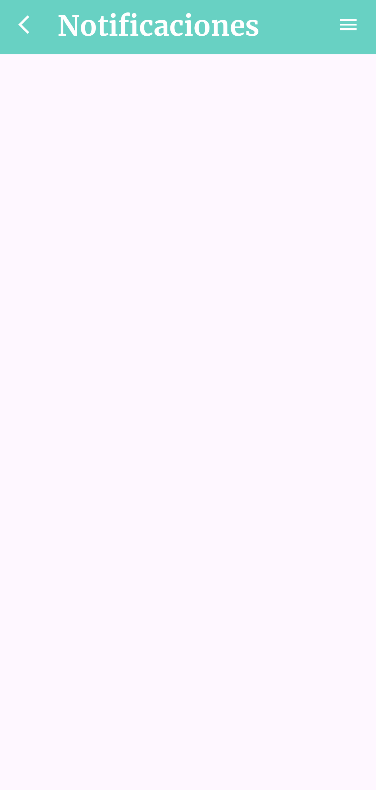
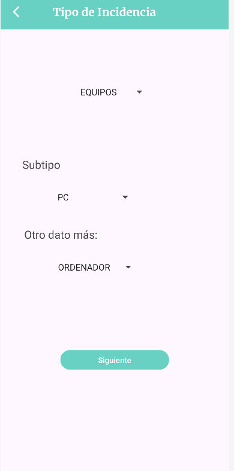
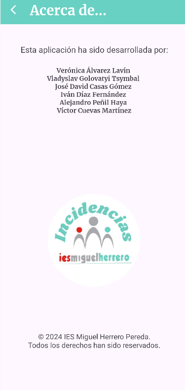

# Proyecto Intermodular

## Login
Esta pagina sera la que aparecera tras abrir la aplicacion contara con un logo y 2 cuadros de texto en los cuales se escribira: nombre de usuario y contraseña. Tambien contara con un opcion que podemos marcar o no para recordar la contraseña. Tambien contara con un enlace por si has olvidado la contraseña para cambiarla o no. Por ultimo un boton de inicio de sesion que verifica si puedes entrar o no, si da fallo significa que el usuario y/o la contraseña no son correctos. Si es correcto todo te lleva a la ventana de _Mis_incidencias_.

___

## Mis incidencias
Seria, por asi decirlo, la ventana principal que muestra un resumen de las incidencias agrupadas por estado (Abiertas, Asignadas, En proceso, Resueltas, Cerradas), asi como un lista de las ultimas incidencias añadidas. Tiene un boton para cada una que nos llevara a una ventana con una lista de las incidencias de ese estado, y al hacerlo se cambia el color del fondo del titulo. Tambien tiene un boton para añadir nuevas incidencias abajo a la derecha que nos llevara a la ventana _Tipo de Incidencia_. Arriba a la derecha cuenta con 3 opciones mas(2 ocultas tras un boton de 3 lineas):

- __Añadir notificación(Campana)__: Al pulsar esta opcion nos llevara a la ventana de _Notificaciones_.
- __Ayuda__: Al pulsar esta opcion nos llevara a la ventana de _Ayuda_.
- __Acerca de__: Al pulsar esta opcion nos llevara a la ventana _Acerca de_.

### Ejemplo de ventana

___

## Ayuda
Esta ventana seria una pequeña guia de como funciona la aplicacion. Cuenta con una flecha que nos devuelve a _Mis incidencias_.

___

## Notificaciones
Esta es la ventana encarga de las notificaciones en ella se muestra una lista de notificaciones, asi como una flecha para volver a la ventana _Mis incidencias_ y la lista con las opciones de _Ayuda_ y _Acerca de_.

___

## Tipo de Incidencia
Se seria una parte de la creacion de incidencias. Cuenta con una flecha que nos devuelve a _Mis incidencias_, un boton de siguiente que nos lleva a la ventana _Incidencia#ID_ y 3 selectores.

- __Selector 1__: Seleccionar nombre de equipo de la lista.
- __Selector 2__: Seleccionar subtipo de incidencia de la lista.
- __Selector 3__: Seleccionar otro dato de la lista.

___

## Incidencia#ID
Seria la continuacion de la ventana _Tipo de incidencia_ que cuenta con muchos mas datos que añadir: Tipo de incidencia (por defecto lo que estaba en los selectores 1 y 2 de la anterior), fecha de creacion, posible descripcion, identificador de equipo, estado (Abierto, Asignado, En proceso, Resuelta, Cerrado), fecha de cierre. Asi como 2 botones:

- __Cancelar__: Al pulsar esta opcion nos llevara a la ventana de _Mis incidencias_.
- __Aceptar__: Al pulsar esta opcion nos llevara a la ventana de _Mis incidencias_ pero con la nueva incidencia ya añadida.

___

## Acerca de
Esta ventana solo seria un resumen, cuenta con una flecha que nos devuelve a la venta _Mis incidencias_. Muestra los nombres de sus desarrolladores, un logo y un texto de copyright con año actual.

